- [battleship_py](#battleship_py)
- [The main technologies that were used in the scope of this project](#the-main-technologies-that-were-used-in-the-scope-of-this-project)
- [How this game looks like](#how-this-game-looks-like)
  - [Index page](#index-page)
  - [New game page](#new-game-page)
  - [Wait for players page](#wait-for-players-page)
  - [Join to the created game page](#join-to-the-created-game-page)
  - [Wait for players page when player \(friend/opponent\) is joined](#wait-for-players-page-when-player-friendopponent-is-joined)
  - [Preparation page \(where ships should be added to the field\)](#preparation-page-where-ships-should-be-added-to-the-field)
  - [Preparation page, choosing the ship to put on board](#preparation-page-choosing-the-ship-to-put-on-board)
  - [Preparation page when direction of the field changed \(arrow with different direction\)](#preparation-page-when-direction-of-the-field-changed-arrow-with-different-direction)
  - [Preparation page when all ships on the board](#preparation-page-when-all-ships-on-the-board)
  - [Gameplay page, waiting for the friend/opponent move/finishing of his/her preparation](#gameplay-page-waiting-for-the-friendopponent-movefinishing-of-hisher-preparation)
  - [Gameplaye page when current player needs to do a move/shot](#gameplaye-page-when-current-player-needs-to-do-a-moveshot)
  - [Result page with winner name and fields of both players](#result-page-with-winner-name-and-fields-of-both-players)
  - [Index page with ability to return to the last game stage page \(wait/preparation/gameplay/results\)](#index-page-with-ability-to-return-to-the-last-game-stage-page-waitpreparationgameplayresults)
- [Main functionality of the game](#main-functionality-of-the-game)
- [Technical Information](#technical-information)
  - [Structure of the repository](#structure-of-the-repository)
  - [Test Code Coverage of the Game Core API](#test-code-coverage-of-the-game-core-api)
  - [Build from sources](#build-from-sources)
    - [Prerequisites](#prerequisites)
    - [Build from sources](#build-from-sources-1)
- [Additional information:](#additional-information)
  - [Endpoints that were created (not REST)](#endpoints-that-were-created-not-rest)
- [TODO in the future](#todo-in-the-future)
# battleship_py
Classic implementation of the board game for 2 players. Also known as [Sea Battle](https://en.wikipedia.org/wiki/Battleship_(game)).

Battleship is a game on python and Flask framework.

It is an education project to learn Python as a language, try python tools for building Web App.

# The main technologies that were used in the scope of this project

- Programming Language: Python 3.10.7 (All development was made on the Mac OS X)
- Web Framework: [Flask 2.2.2](https://flask.palletsprojects.com/en/2.2.x/)
- Html lib: [Bootstrap 5.2](https://getbootstrap.com/docs/5.2/getting-started/introduction/)
- Dependency management: [Poetry](https://python-poetry.org/). Required version **1.2.0+**

# How this game looks like

Below you can find screenshots made on phone

## Index page

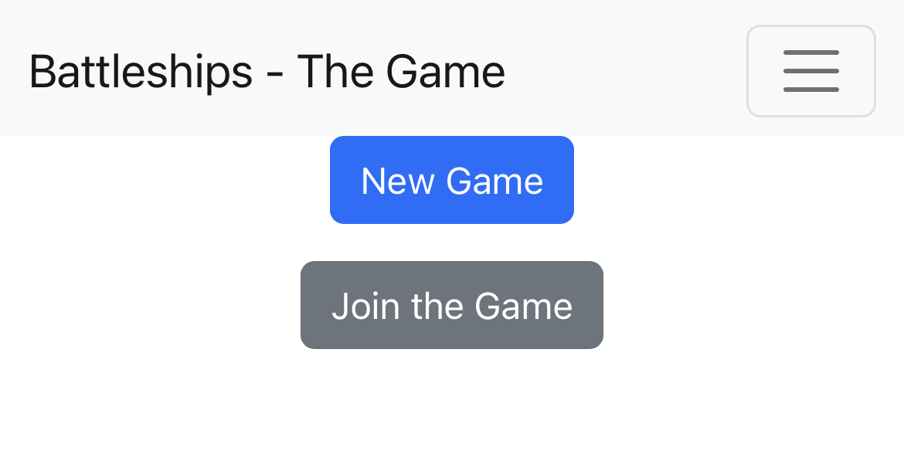

## New game page

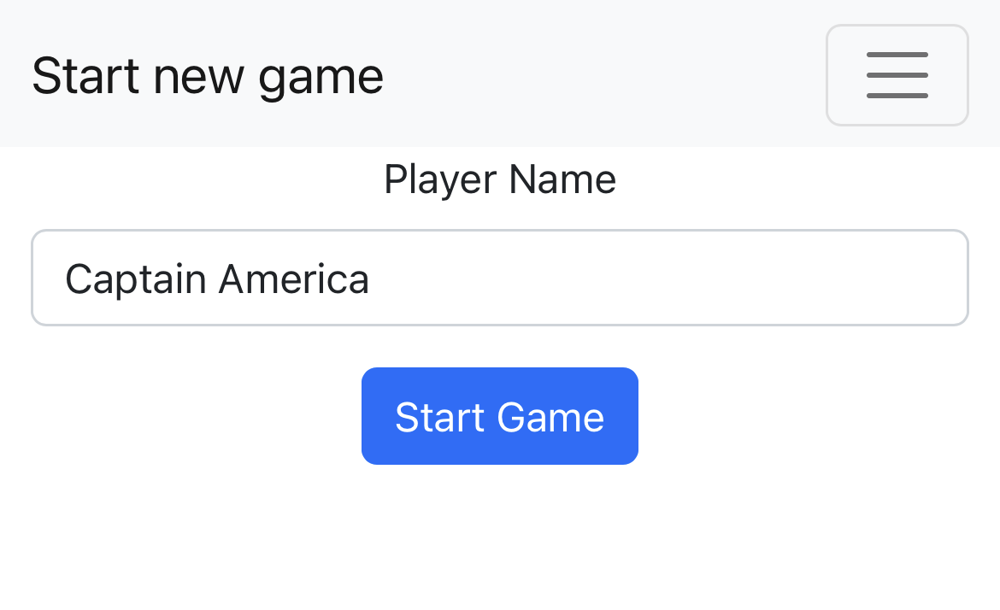

## Wait for players page

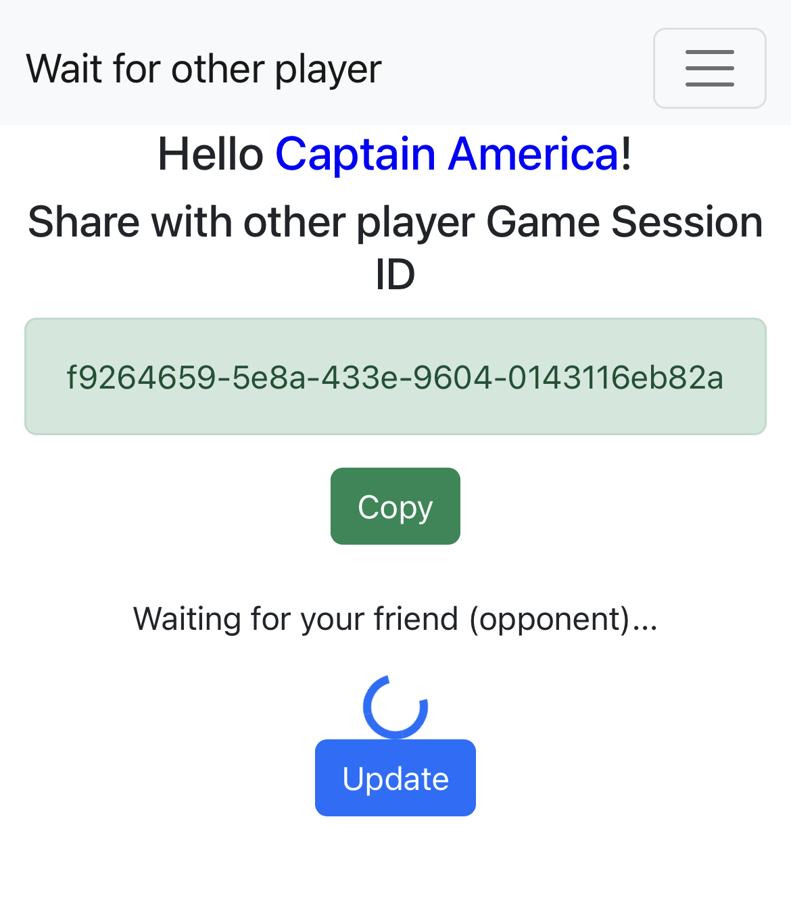

## Join to the created game page

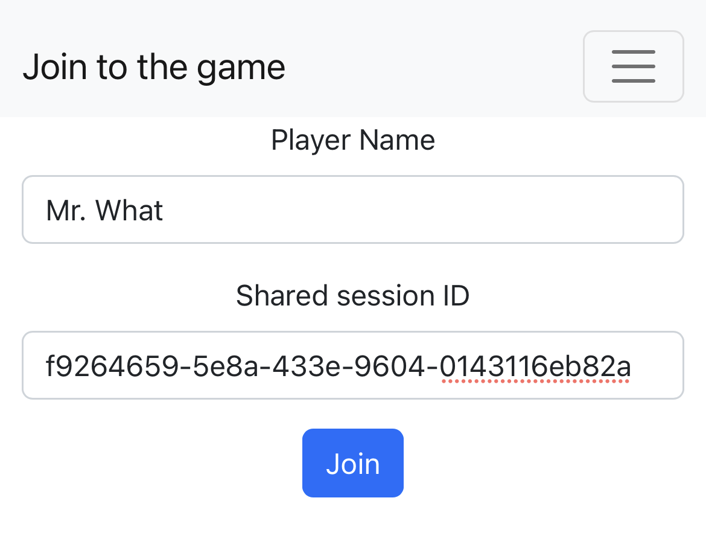

## Wait for players page when player \(friend/opponent\) is joined

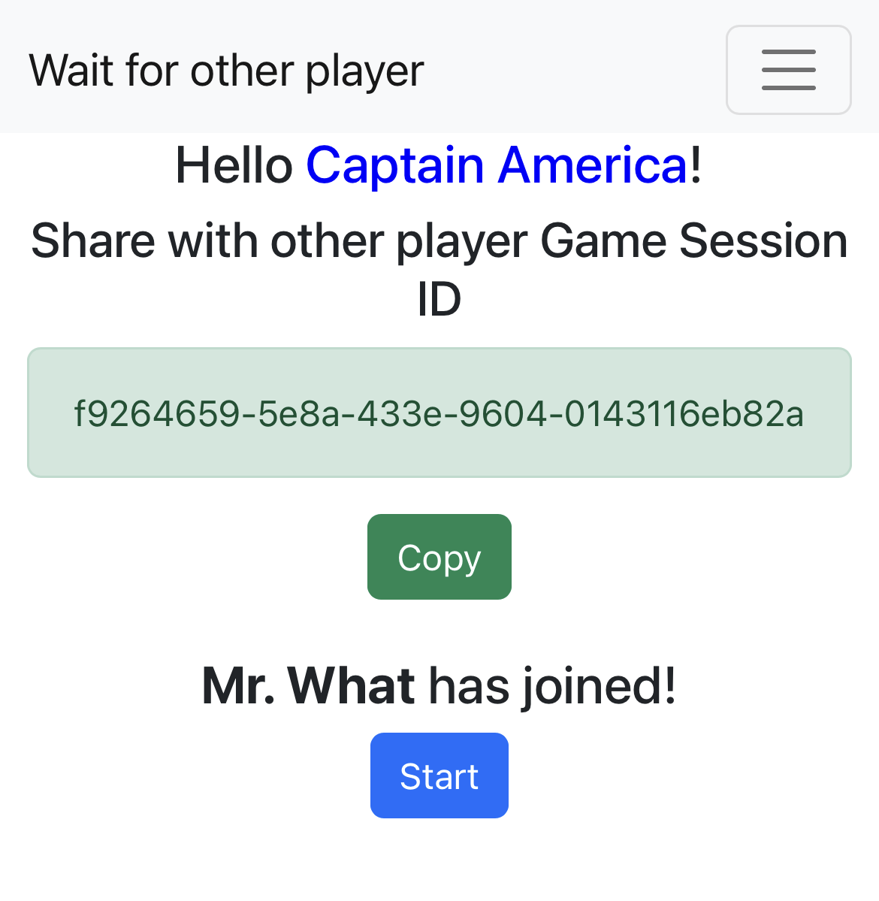

## Preparation page \(where ships should be added to the field\)

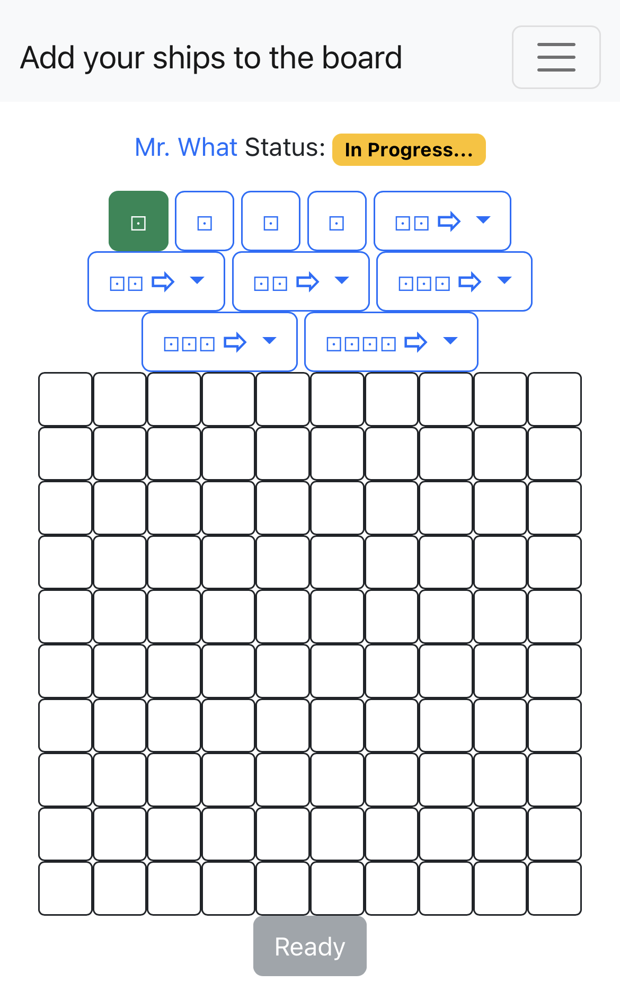

## Preparation page, choosing the ship to put on board

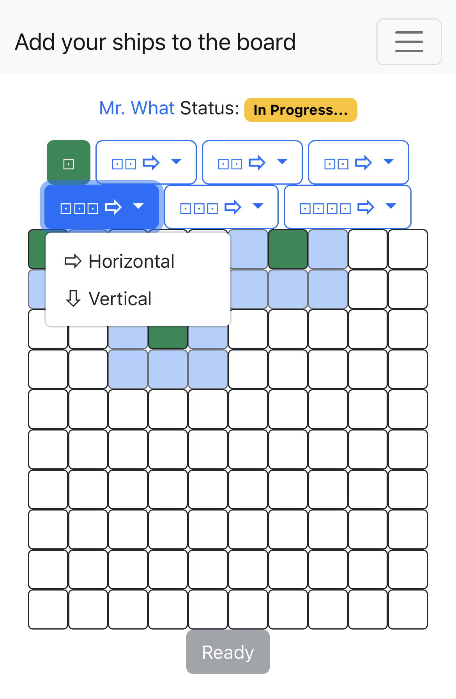

## Preparation page when direction of the field changed \(arrow with different direction\)

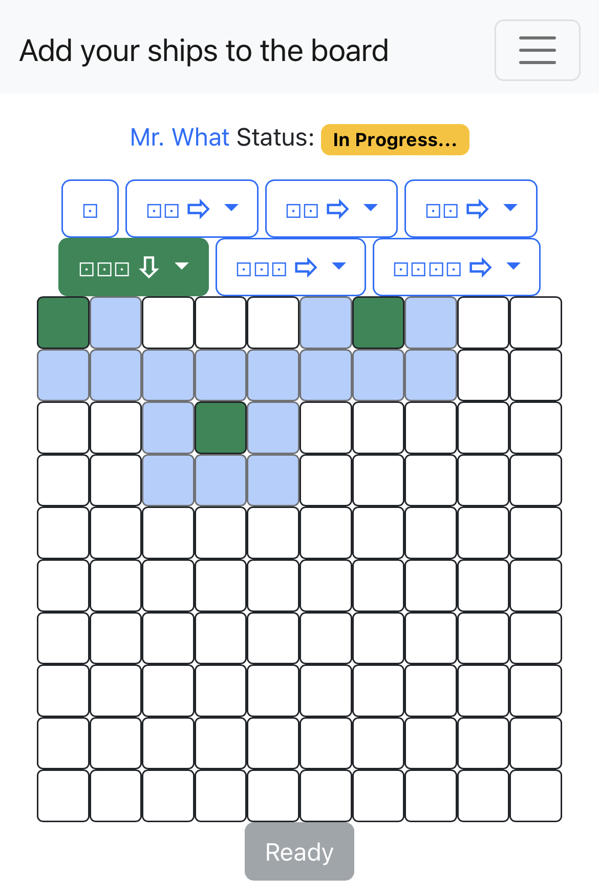

## Preparation page when all ships on the board

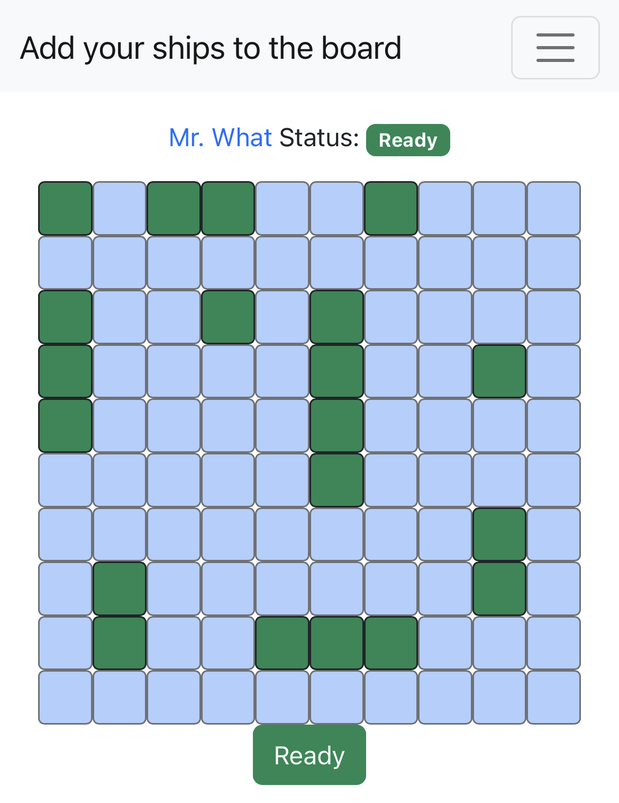

## Gameplay page, waiting for the friend/opponent move/finishing of his/her preparation

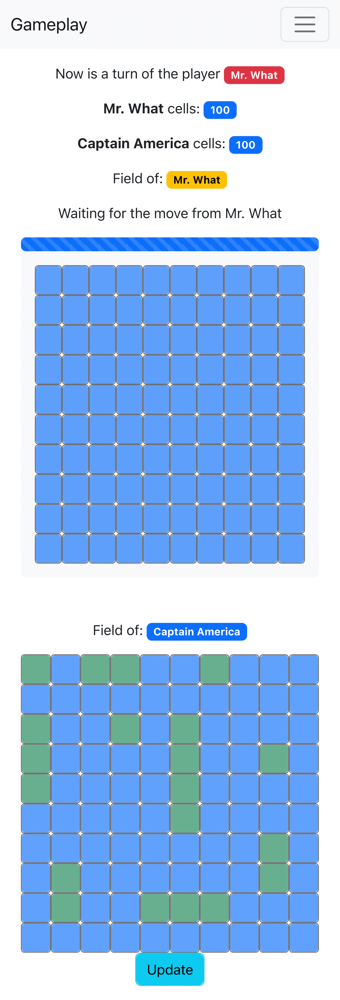

## Gameplaye page when current player needs to do a move/shot

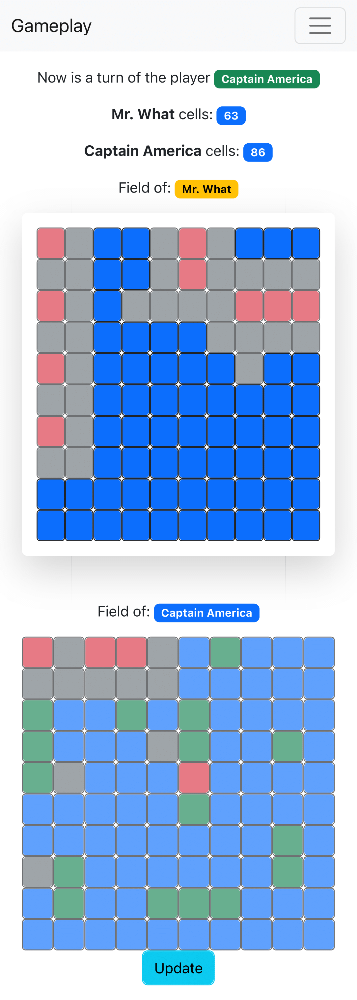

## Result page with winner name and fields of both players

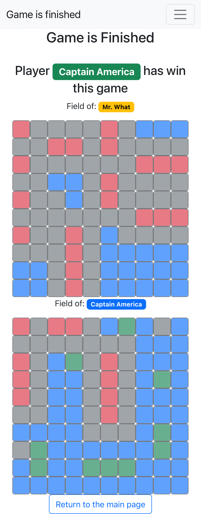

## Index page with ability to return to the last game stage page \(wait/preparation/gameplay/results\) 

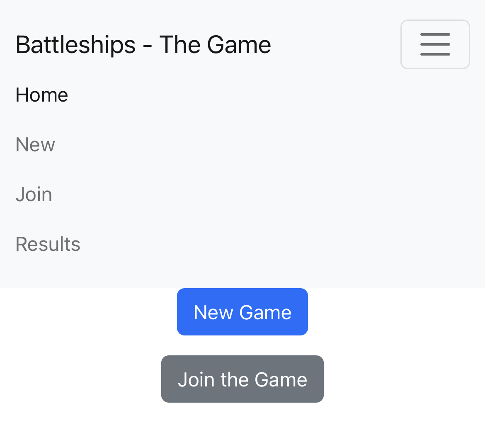


# Main functionality of the game

You as a user of this app (game) has ability to:

- Start New Game
- Join game
- Add ships to the board with appropriate direction
- Make shots to the opponent field
- Get all information about results of the game

# Technical Information

## Structure of the repository

- **docs** - folder with screenshots and should be used for keeping any documentation
- **battleapi** - folder with the base code of the app and provides API to build UI around this API
- **battleflask** - folder with implementation of the Flask app
- **tests** - folder contains unittests for the **battleapi**
- [**pyproject.toml**](pyproject.toml) - all the configuration of the project for the package managers and build tools
- [**poetry.lock**](poetry.lock) - lock file with all the dependencies used in the project. More information about
  poetry can be found on their [website](https://python-poetry.org/)

## Test Code Coverage of the Game Core API

[test-coverage](docs/coverage_2022-10-16.txt)

Total coverage by tests of the battleapi module is 99%

## Build from sources

### Prerequisites

- You should have installed Python to you PC. Python installers and instructions can be found on the official [**Python
  Page**](https://www.python.org/)
- You also should have to install Poetry package manager. Instruction can be found on the official [**Poetry
  page**](https://python-poetry.org/docs/#installation)
- If you want to clone this repository, then probably you also need a [**GIT**](https://git-scm.com/) preinstalled.

### Build from sources

1. Open Terminal on your OS
2. Navigate to the folder with this app
  ```shell
  cd /path/to/the/root/of/battleship_py
  ```
3. Create virtual environment for Python if you want to have all the dependencies preinstalled inside app directory.
Poetry will automatically create virtual environment, but if you create one inside app folder - poetry will use this instead its default. **(OPTIONAL)**

```shell
python3 -m venv .venv 
```

4. Install dependencies by poetry

```shell
poetry install
```

5. To check that everything is ok - you can run tests with coverage

```shell
poetry run coverage run -m pytest  # To run tests and create coverage file

poetry run coverage report  # To generate report of coverage

poetry run coverage html  # To generate html report of coverage
```

6. After installation, you should now have ability to start application via entry points created in the scope of
   installation script

```shell
# UNIX: Linux, Mac OS X, etc
export FLASK_APP_KEY='YOUR_SECRET_APP_KEY' 
poetry run battleships
```
```shell
# Windows (Tested on Windows 10 Pro)
SET FLASK_APP_KEY='YOUR_SECRET_APP_KEY'
poetry run battleships
```

7. To build **PACKAGE** for using in the other projects or to push to cloud package repositories run:

```shell
poetry build
```

It will build **tar.gz** and **.whl** packages

# Additional information:

## Endpoints that were created (not REST)
  - **GET** ****base_url/**** Returns the main page of the application.
  - **GET** ****base_url/game/<string\:session_id>/finish**** Returns page with game results information.
  - **GET** ****base_url/game/<string\:session_id>/gameplay**** Returns gameplay page with players fields.
  - **GET** ****base_url/game/<string\:session_id>/prepare**** Returns preparation page where players need to put ships on the board.
  - **GET** ****base_url/game/<string\:session_id>/wait**** Returns page with wait for player information.
  - **GET** ****base_url/join**** Returns join game page with form for joining player to existing game.
  - **GET** ****base_url/new**** Returns new game page with form for creation of the game.
  - **POST** ****base_url/game/<string\:session_id>/gameplay/shot**** Makes shot to opponent field and redirect to the gameplay page.
  - **POST** ****base_url/game/<string\:session_id>/gameplay/start**** Starts the game for player and redirect to the gameplay page.
  - **POST** ****base_url/game/<string\:session_id>/prepare/addship**** Adds ship to the player board and redirects to the preparation page.
  - **POST** ****base_url/game/<string\:session_id>/prepare/chose**** Chooses current ship that will be added to the board next and redirects to the preparation page.
  - **POST** ****base_url/game/<string\:session_id>/prepare/delship**** Removes ship from the player board and redirects to the preparation page.
  - **POST** ****base_url/game/join**** Join player to started game and redirects to the preparation page.
  - **POST** ****base_url/game/start**** Create new game started by a player and redirects to the wait page.

# TODO in the future

In this project there are plans to add:
- Error handling for any exception that can be raised during gameplay
- Direct link for joining
- Other languages to UI
